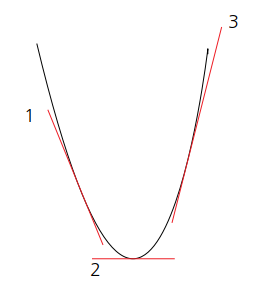
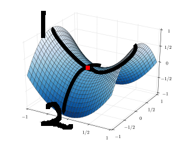
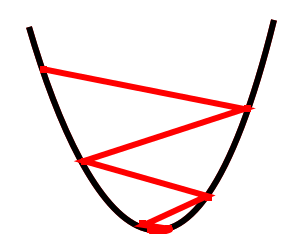
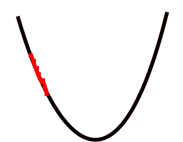
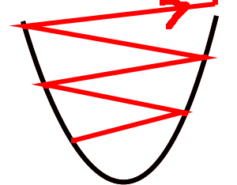

# 학습 
학습이란, 주어진 데이터를 이용해서 최적의 매개변수 값을 찾아가는 과정이다.  
__최적__ 의 의미는?   
Loss Function를 최소화 하는 값이다.  
이에 관해서는 아래서 알아봄.  
간단하게 이해하면, 손실이 적으면 정확도는 높을 것.  
## 데이터
앞에서 정리한 퍼셉트론의 경우 가중치 값을 사람이 직접 정함.   
지금부터는, 주어진 training data를 통해 __스스로__ 정해간다.   
- Training Data  
- Test Data   

우선, 훈련 데이터를 이용해 가중치를 수정해 나가고,  
얼마나 잘 학습한지를 테스트 데이터를 이용해 평가한다.   
다만, 특정 훈련 데이터 셋에 너무 최적화되어 다른 데이터 셋은 못 맞추는  
현상이 발생 가능하며, 이를 __오버피팅(Overfitting)__ 이라고 한다.   
    
지금 부터 최적의 매개변수를 찾을 수 있는 지표가 되는 손실함수에 대해 알아보자.   
# Loss Function(Cost Function)
일반적으로 사용하는 함수는 __오차제곱합__ 그리고 __교차 엔트로피 오차__ 이다.   
## SSE(Sum of Squares for Error, 오차제곱합)
말 그대로 오차를 제곱한 값들의 합이다.   
오차: 신경망의 추정값과 실제 답의 차이  
식으로 나타내면  
```python
#y는 신경망의 추정 값 
#t는 실제 정답 레이블
E = (0.5)*SUMk(Yk-Tk)^2
```
python으로 구현하면   
```python
def SSE(y, t):	#y and t are the numpy array
	return (0.5)*np.sum((y-t)**2)
```
ex)   
y = [0.1, 0.1, 0.7, 0.1]    
t = [0,   0,   1,   0]     
신경망은 2번 뉴런을 답으로 추정하고,   
실제로 답이 2번 뉴런인 경우 값은 0.060000000001로 매우 작다.    
즉, 신경망의 정확도가 높다는 의미! (가중치가 잘 학습됨) 
## CEE(Cross Entropy error, 교차 엔트로피 오차)
식은 아래와 같다.    
```python
E = -SUMk(Tk*logYk)
```
식은 복잡해보여도, 결국 T는 정답 레이블 하나 제외하곤 다 0이므로   
정답으로 추정되는 Y의 로그값을 의미한다.   
     
이처럼 정답만 1이고 나머지는 0으로 만드는 것을 원-핫 인코딩이라고 한다.   
다만 주의할 점은 log안의 값이 0이면 -inf로 발산하므로   
이를 방지하기 위해 로그 안에 작은 값을 더해야 한다.   
그래서 python으로 구현하면 다음과 같다.   
```python
def CCE(y, k):
	delta = 1e-7
	return -np.sum(t*np.log(y+delta))
```
## 미니배치(mini-batch). 미니배치는 배치학습과 다른가?  
우리가 CH3에서 보았던 batch 입력은 입력 과정에서 하나씩 신경망에 넣는게 아니라   
묶어서 입력을 만드는 것이였다.  
그럼 미니배치는 뭘까?   
모든 데이터에 대해서 손실 함수의 합을 구하기가 제한되는 경우가 있다.   
MNIST 손글씨만 보더라도 데이터가 60,000개이다.   
이때, __데이터 일부를 추려서 전체의 '근사치'로 이용하는 방식__이 미니배치이다.  
그 예로 60,000개의 손글씨 데이터 중 100개만 무작위로 뽑아 학습하는 것이 될 수 있다.   

## 그래서 손실함수는 왜 사용할까?
사실, 우리의 목적은 신경망을 학습해서 정확도를 높이는 것이다.    
그럼 그냥 정확도를 최대한 높게하는 매개변수를 찾으면 되지,    
굳이 손실함수를 최소화 할 필요가 있을까?     
     
문제는 정확도를 나타내는 함수는 주로 [여기](https://github.com/lufovic77/DLfromScratch/blob/master/CH3_neuralNetwork/README.md)에서 소개한 **step function**의 형태를 가진다는 것이다.       
즉, 매개변수를 조금씩 움직여도 정확도는 안 바뀔 수도 있고, 혹은 급격하게 바뀔 수 있다.     
	     
이에 반해 loss function은 sigmoid 함수 같은 형태를 띠기 때문에,    
매개변수를 세밀하게 조절해도 값에서 연속적인 차이를 보인다.     
		       
이는 추후 우리가 도입하는 미분과도 큰 영향이 있는데,     
계단 함수와 sigmoid함수는 미분 시 아래와 같은 차이가 있다.   
- 계단 함수   
: 미분 시 0이 되는 지점이 많이 존재한다.   
- Sigmoid 함수   
: 0이 되는 곳이 거의 없어 **매개변수 조정의 방향을 알려준다.**   

우리는 손실함수를 미분하여 그 극솟값이나 최솟값을 찾으려고 한다.     
만약 **미분 값이 음수**라면, **양의 방향으로 이동**해 값을 최소화 해야 하며,     
**양수라면** **음의 방향으로 이동**해 값을 최소화 해야 한다.      
이는 다음 그림을 보면 간단히 이해 할 수 있다. 
			         
     

해당 그래프가 손실함수의 그래프라고 하자.   
이때, 2번 접선은 손실함수의 최솟값을 나타낸다.   
- 1번 접선  
: 해당 점에서는 기울기가 음수이다. 즉, 최솟값인 2번으로 가기 위해서는   
양의 방향으로 이동해야 한다.   
- 3번 접선  
: 1번과 반대로 기울기가 양수이므로, 최솟값으로 가기 위해서는    
음의 방향으로 이동해야 한다.    

위와 같은 이유로 미분 값이 대부분 0인 함수, 즉 정확도는 쓸모가 없다.   
우회적인 방법을 취해 매개변수 조정의 방향을 제시해주는 손실함수를 이용하도록 하자.   


# 경사 하강법(Gradient Descent Method)
지금까지 정리했던 내용대로, 기계학습에서는 최적의 매개변수를 찾아내는 것이 관건이며, 
여기서 '**최적**'의 의미란 **손실함수를 최솟값으로 만드는** 적절한 값이다.   

바로 위에서는 2차함수를 예로 들어 기울기를 이용해 매개변수의 최솟값을 찾아가는 방법을 소개했다.   
그러나 실제 상황에서의 손실 함수는 2차함수처럼 간단하지 않아 최솟값을 찾는게 그리 쉬운 문제는 아니다.  

> 또한, 기울기가 가리키는 방향에 정말로 최솟값이 있다는 것도 보장할 수 없다. 

책에서 제시하는 간단한 예시를 한번 보자. 
  

*Reference: [https://en.wikipedia.org/wiki/Saddle_point](https://en.wikipedia.org/wiki/Saddle_point)*

그림에서 표시한 빨간 점은 1번의 그래프에서는 최솟값(극솟값)이다.  
그렇다고 이 값이 전체에서의 최솟값일까 ?    

2번 그래프에서 보면 오히려 이 빨간점은 최댓값(극댓값)임을 알 수 있다.  
즉, 한 관점에서 최솟값이라고 전체에서 최솟값이 아니라는 소리다.  

이러한 문제 때문에 경사 하강법(Gradient Descent Method)가 등장한다.   

## 경사 하강법이란?
경사 하강법(경사법)이란 **현 위치**에서 **기울어진 방향**으로 **일정 거리**만큼 이동하는 방식이다.   
이를 간단한 수식으로 알아보자.  
> $$x = x - \eta*\frac{\partial f}{\partial x}$$

수식에서 각 항목은 다음과 같이 대응된다.  

 - $x$: 현재 위치
 - $\eta$: 일정 거리
 - $\frac{\partial f}{\partial x}$: 기울어진 방향으로 (기울기)

여기서 **일정 거리**를 나타내는 $\eta$는 **learning rate(학습률)** 이라고 하며 보통 0.001같은 값으로 지정한다. 
즉, 학습률은 현재 위치를 얼마만큼 갱신할지를 정하는 아주 중요한 하이퍼파라미터이다.  

이러한 경사 하강법은 python을 이용해서 다음과 같이 구현할 수 있다.  

    def gradient_descent(f, init_x, lr = 0.01, step_num = 100):
	    x = init_x
	    for i in range(step_num):
		    grad = gradient(f, x)
		    x = x - lr*grad
		return x
앞서 본 수식은 1번 학습을 진행할 때 갱신되는 정도이다.  
위의 코드에서는 이 학습은 step_num 만큼 반복하는 것을 볼 수 있다.  
즉, 100번만큼 조금씩 기울기가 가리키는 방향으로 나아간다는 의미이다!!  

## Learning Rate(학습률)
적절한 학습률을 설정하는 것은 매우 중요한데, 이는 다음 그림을 보면 바로 이해될 것이다.  
편의를 위해 손실함수는 2차함수이며, 극솟값이 곧 최솟값을 의미함을 가정한다. 
1) 학습률이 적절한 경우

   
2) 학습률이 너무 작은 경우

    
3) 학습률이 너무 큰 경우

   

1번의 경우 극솟값을 잘 찾아감을 알 수 있다.  
2번의 경우 현재 위치가 거의 갱신되지 않아 한번의 학습 과정으로 끝나지 않음을 알 수 있다.   
3번의 경우 갱신 정도가 너무 커서 발산 해버리는 모습을 볼 수 있다.  

이렇듯 학습률의 크기는 적절하게 정해줘야 하는데  
학습률은 보통 우리가 지금까지 불렀던 '매개변수'가 아닌 '**하이퍼파라미터**'라고 부르는 경우가 많다.   

- 매개변수 
: 가중치(weight) 편향(bias)같은 변수들을 말한다. 
이들은 학습을 진행하다보면 자동으로 조절되며 최적의 값을 얻어간다.
- 하이퍼파라미터
: 학습률 같은 변수이며 이런 변수는 사람이 직접 적절한 값을 결정해줘야 한다.  
